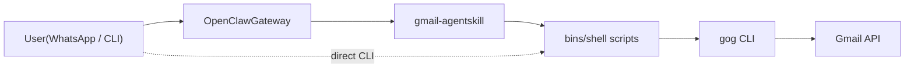

<!-------->
[](#)
[](https://github.com/nicholasgasior/gog)
[](https://openclaw.ai)
[](https://clawhub.ai/r39132/gmail-agent)
[](./LICENSE)


---

<p align="center">
  
</p>

# Gmail Agent

A CLI-driven Gmail agent that summarizes unread messages, purges spam/trash folders, moves messages to labels via keyword search, deletes labels with optional message cleanup, and permanently deletes old messages by date. Ships with an [OpenClaw](https://openclaw.ai) skill for chat-based and scheduled use, but the core scripts work standalone with **any agent framework** or directly from the command line.

---

## Quick Start

> Full GCP/OAuth setup instructions: **[Setup Guide](docs/SETUP.md)**

```bash
# 1. Install the CLI tools
brew install jq bash          # macOS — Linux: apt-get install jq
npm install -g gogcli

# 2. Authenticate with Google
gog auth login

# 3. Set your Gmail account
echo 'GMAIL_ACCOUNT="you@gmail.com"' > .env && source .env

# 4. Try it out
gog gmail messages search "in:inbox" --account "$GMAIL_ACCOUNT" --max 5 --plain
```

---

## Demo

<p align="center">
  
  <br />
  <em>Gmail Agent delivering an inbox summary via WhatsApp through OpenClaw</em>
</p>

The screenshot shows a WhatsApp conversation where I'm messaging myself. **Mr. Krabs**, my OpenClaw Superagent, listens to incoming messages and responds by executing the Gmail Agent skill. When I send "Summarize my inbox," Mr. Krabs triggers the skill, fetches my unread emails via the Gmail API, and replies with the summary—all within the same WhatsApp thread.

---

## Features

| Capability | Description |
|---|---|
| **Inbox summary** | Lists ALL inbox messages (read + unread). Marks unread with "**". Groups by sender when count > 20. |
| **Folder structure** | Tree view of all Gmail labels with total and unread counts. |
| **Spam & trash purge** | Batch-removes all messages from SPAM and TRASH folders. |
| **Move to label** | Search labels by keyword and move messages from inbox interactively. |
| **Delete labels** | Delete a label and all sublabels with optional trashing of ALL messages. Labels deleted via Gmail API (Python). |
| **Delete old messages by date** | Delete messages older than a date from a label and its sublabels. Supports permanent delete with full-scope auth. |
| **Full-scope authorization** | One-time OAuth setup for `https://mail.google.com/` scope, enabling permanent message deletion (instead of trash). |
| **Background execution** | Run any task in background with WhatsApp progress updates every 30s and completion notifications. |
| **Job status tracking** | Monitor all running/completed background jobs with duration and logs (`~/.gmail-agent/jobs/`). |
| **Convenience wrappers** | `gmail-bg` (auto-sources .env + runs background task) and `gmail-jobs` (check job status). |
| **Daily digest** | Scheduled cron job: summarize + purge, delivered to WhatsApp (via OpenClaw). |

---

## Background Execution

All tasks can run in the background with WhatsApp progress updates:

```bash
# Set your WhatsApp number for notifications
export WHATSAPP_NOTIFY_TARGET="+15555550123"

# Run any task in background
bash skills/gmail-agent/bins/gmail-background-task.sh \
    "Spam & Trash Cleanup" \
    "bash skills/gmail-agent/bins/gmail-cleanup.sh '$GMAIL_ACCOUNT'"
```

**What happens:**
- Task runs in background immediately
- WhatsApp notification every 30s with elapsed time
- Final WhatsApp notification with complete results
- All output logged to `/tmp/gmail-bg-*.log`

**Check status of all background jobs:**
```bash
bash skills/gmail-agent/bins/gmail-bg-status.sh

# Options
bash skills/gmail-agent/bins/gmail-bg-status.sh --running   # Only running
bash skills/gmail-agent/bins/gmail-bg-status.sh --completed # Only completed
bash skills/gmail-agent/bins/gmail-bg-status.sh --json      # JSON output
bash skills/gmail-agent/bins/gmail-bg-status.sh --clean     # Remove old jobs
```

**When to use background mode:**
- Long-running tasks (folder structure, large cleanups)
- Scheduled/automated runs (daily digest)
- When you don't need to wait for completion

**WhatsApp notification examples:**

Initial:
```
📧 Gmail Agent: Starting task 'Spam & Trash Cleanup'
Account: you@gmail.com
Started: 2026-02-11 14:30:00
Running in background... Updates every 30s
```

Progress (every 30s):
```
⏳ Gmail Agent: Task 'Spam & Trash Cleanup' still running...
Duration: 1m 30s
Updates: 3
Task is progressing in background.
```

Completion:
```
✅ Gmail Agent: Task 'Spam & Trash Cleanup' completed successfully
Duration: 2m 45s
Account: you@gmail.com
Completed: 2026-02-11 14:32:45

━━━━━━━━━━━━━━━━━━━━━━━━━━
Output:
━━━━━━━━━━━━━━━━━━━━━━━━━━
Cleaning Gmail for you@gmail.com...
Spam: 124 messages cleaned
Trash: 89 messages cleaned
Done.

Log: /tmp/gmail-bg-20260211-143000.log
```

---

## Skills & Triggers

### How Triggering Works

**Gmail Agent uses semantic triggering, not exact phrases.** When using it through OpenClaw, Claude Desktop, or other LLM-based frameworks, the AI interprets your natural language request and routes to the appropriate skill based on meaning.

**You can ask in many ways:**
- "Check my email" → Inbox Summary
- "What's new in my inbox?" → Inbox Summary  
- "Summarize my mail" → Inbox Summary
- "How many unread messages?" → Inbox Summary

The agent understands intent, not just keywords.

### Listing Available Skills

**With OpenClaw:**
```bash
openclaw skills list | grep gmail
```

Shows installed Gmail Agent skills with their descriptions.

**Checking skill details:**
```bash
cat skills/gmail-agent/SKILL.md
```

View the full skill definition with all capabilities and trigger patterns.

### Available Skills & Example Triggers

#### 1. Inbox Summary
**What it does:** Lists ALL inbox messages (read + unread) with sender, subject, and date. Marks unread messages with "**" prefix. Groups by sender when count > 20.

**Example triggers:**
- "Summarize my inbox"
- "Check my email"
- "What's new in my inbox?"
- "Show me my inbox"
- "List my inbox messages"

**Mode options:**
- **Inbox (default):** Shows ALL inbox messages, marks unread with "**"
- **All unread:** "Summarize ALL my emails", "Show me everything unread" (searches all folders)

#### 2. Folder Structure
**What it does:** Tree view of all Gmail labels with total and unread counts.

**Example triggers:**
- "Show my folder structure"
- "List my labels"
- "How are my emails organized?"
- "What labels do I have?"
- "Show me my Gmail folders"

**Note:** Takes 1-2 minutes to run (fetches counts for each label individually).

#### 3. Spam & Trash Purge
**What it does:** Batch-deletes everything in SPAM and TRASH folders with pagination handling.

**Example triggers:**
- "Clean my spam and trash"
- "Empty spam folder"
- "Purge trash"
- "Delete spam and trash"
- "Clean up junk mail"

#### 4. Move to Label (Interactive)
**What it does:** Search labels by keyword and move messages from inbox through an interactive workflow.

**Example triggers:**
- "Move messages to Receipts"
- "File these emails in Travel"
- "Move to Walmart folder"
- "Organize inbox messages"

**Interactive workflow:**
1. Asks for search keywords
2. Shows matching labels
3. Lists inbox messages
4. Confirms selection
5. Moves messages
6. Offers undo option

#### 5. Delete Labels (Destructive)
**What it does:** Deletes a label and all its sublabels, with optional trashing of ALL messages. Labels are deleted via the Gmail API (Python).

**Example triggers:**
- "Delete my Professional/OldCompany label"
- "Remove the Travel/2020 folder and everything under it"
- "Delete the Archive/2019 label"

**Interactive workflow:**
1. Confirms label deletion intent
2. Asks whether to also delete messages (ALL messages with these labels)
3. Shows all matching labels (target + sublabels)
4. Requires explicit 'DELETE' confirmation
5. Executes deletion and reports results

**Note:** When deleting messages, they are trashed (auto-deleted by Gmail after 30 days).

#### 6. Delete Old Messages by Date (Destructive)
**What it does:** Deletes all messages older than a specific date from a specified label and its sublabels. **Requires both a date AND a label.** Supports permanent delete with full-scope auth.

**Example triggers:**
- "Delete messages older than 01/01/2020 from Personal/Archive"
- "Remove emails before 12/31/2019 from Work/Old"
- "Clean up old messages in Professional/Learn before 10/01/2025"

**Workflow:**
1. Confirms date and label (both required)
2. Searches messages older than the date IN the specified label
3. Permanently deletes (with full-scope token) or trashes (without) all matching messages
4. Loops until no more matches (handles Gmail index consistency)
5. Reports count

**Deletion mode:** If `~/.gmail-agent/full-scope-token.json` exists, messages are permanently deleted. Otherwise, they are trashed.

#### 7. Full-Scope Authorization (One-Time Setup)
**What it does:** Performs a one-time OAuth flow to grant the `https://mail.google.com/` scope, enabling permanent message deletion instead of trash.

**Example triggers:**
- "Enable permanent delete for Gmail"
- "Set up full Gmail access"

**What happens:**
1. Opens a browser for Google OAuth consent
2. Grants `https://mail.google.com/` scope (full Gmail access)
3. Stores the token at `~/.gmail-agent/full-scope-token.json`
4. Capability 6 will then use permanent delete instead of trash

#### 7. Daily Digest (Cron)
**What it does:** Scheduled cron job that summarizes all unread emails, purges spam/trash, and delivers report via WhatsApp.

**Trigger:** Automatic (runs on schedule, default: noon Pacific)

**Manual trigger:**
```bash
openclaw cron run gmail-daily-noon
```

### Agent Response Format

When using through OpenClaw or similar frameworks, the agent returns:
- ✅ **Confirmation** of which skill was executed
- 📊 **Results** (message counts, summaries, etc.)
- 🔄 **Next actions** (if multi-step workflow)

Example:
```
[Gmail Agent - Inbox Summary]
Found 12 unread messages:

From: john@example.com
Subject: Meeting tomorrow
...

Skill executed: gmail-agent/inbox-summary
```

---

## How It Works



The agent is a set of **bash scripts** that wrap the [`gog` CLI](https://github.com/nicholasgasior/gog). OpenClaw provides chat routing and scheduling, but the scripts run independently — pipe them into any framework that can exec shell commands.

---

## Usage

### Standalone (CLI)

```bash
source .env

# Summarize ALL inbox messages (read + unread)
gog gmail messages search "in:inbox" --account "$GMAIL_ACCOUNT" --max 50 --plain

# Summarize ALL unread messages everywhere (excludes spam/trash)
gog gmail messages search "is:unread -in:spam -in:trash" --account "$GMAIL_ACCOUNT" --max 50 --plain

# Show folder structure with message counts
bash skills/gmail-agent/bins/gmail-labels.sh "$GMAIL_ACCOUNT"

# Clean spam and trash
bash skills/gmail-agent/bins/gmail-cleanup.sh "$GMAIL_ACCOUNT"

# Move messages to a label (interactive)
# Step 1: Search for labels matching keywords
bash skills/gmail-agent/bins/gmail-move-to-label.sh "$GMAIL_ACCOUNT" --search-labels "receipts"

# Step 2: List inbox messages
bash skills/gmail-agent/bins/gmail-move-to-label.sh "$GMAIL_ACCOUNT" --list-inbox

# Step 3: Move selected messages to a label
bash skills/gmail-agent/bins/gmail-move-to-label.sh "$GMAIL_ACCOUNT" --move "Personal/Receipts" msg-id-1 msg-id-2

# Step 4: Undo if needed
bash skills/gmail-agent/bins/gmail-move-to-label.sh "$GMAIL_ACCOUNT" --undo "Personal/Receipts" msg-id-1 msg-id-2

# Delete a label and all sublabels (labels only, keep messages)
bash skills/gmail-agent/bins/gmail-delete-labels.sh "Professional/OldCompany" "$GMAIL_ACCOUNT"

# Delete a label and ALL messages (trashes them)
bash skills/gmail-agent/bins/gmail-delete-labels.sh "Professional/OldCompany" --delete-messages "$GMAIL_ACCOUNT"

# Delete messages older than a specific date (trashes or permanently deletes)
bash skills/gmail-agent/bins/gmail-delete-old-messages.sh "Personal/Archive" "01/01/2020" "$GMAIL_ACCOUNT"

# Enable permanent delete (one-time OAuth setup)
bash skills/gmail-agent/bins/gmail-auth-full-scope.sh "$GMAIL_ACCOUNT"
```

#### Convenience wrappers

```bash
# Run any task in background (auto-sources .env)
bash skills/gmail-agent/bins/gmail-bg "Spam Cleanup" \
    "bash skills/gmail-agent/bins/gmail-cleanup.sh '$GMAIL_ACCOUNT'"

# Check background job status
bash skills/gmail-agent/bins/gmail-jobs            # All jobs
bash skills/gmail-agent/bins/gmail-jobs --running   # Running only
bash skills/gmail-agent/bins/gmail-jobs --clean     # Remove old records
```

### With OpenClaw

```bash
# Install the skill from ClawHub (recommended)
clawhub install gmail-agent

# Or install from source
bash setup/install-skill.sh

# Register the daily cron job
bash setup/register-cron-jobs.sh

# Verify
openclaw skills list | grep gmail
openclaw cron list
```

Then message OpenClaw through any connected channel:

- *"Summarize my unread emails"*
- *"Check my inbox"*
- *"Show my folder structure"*
- *"Audit my Professional/Companies label"*
- *"Clean up the Personal/Taxes/2020 label"*
- *"Clean my spam and trash"*
- *"Move messages to Receipts folder"*
- *"File these emails in Travel"*
- *"Delete my Professional/OldCompany label"*

The cron job fires daily at noon Pacific (configurable in `.env`). It summarizes all unread emails, purges spam and trash, and delivers the report to WhatsApp.

<details>
<summary>With other agent frameworks</summary>

The core logic is plain shell commands using the `gog` CLI. You can integrate it with any framework that can execute shell commands.

**Claude Code / Claude Desktop (MCP)** — Use the `gog` commands from `SKILL.md` as tool calls. The SKILL.md file itself serves as a prompt/instruction document that any LLM agent can follow.

**LangChain / LangGraph** — Wrap the shell commands as tools:

```python
from langchain_core.tools import tool
import subprocess, os

@tool
def summarize_inbox() -> str:
    """List unread Gmail messages."""
    result = subprocess.run(
        ["gog", "gmail", "messages", "list",
         "is:unread",
         "--account", os.environ["GMAIL_ACCOUNT"],
         "--max", "50", "--json"],
        capture_output=True, text=True
    )
    return result.stdout

@tool
def clean_spam_trash() -> str:
    """Purge spam and trash folders."""
    result = subprocess.run(
        ["bash", "skills/gmail-agent/bins/gmail-cleanup.sh"],
        capture_output=True, text=True
    )
    return result.stdout
```

**CrewAI** — Use CrewAI's shell tool or a custom tool that calls `gmail-cleanup.sh` and the `gog` CLI commands listed in SKILL.md.

**Plain cron (no agent framework)** — Schedule via system cron:

```bash
# crontab -e
0 12 * * * source ~/.env && bash ~/Projects/gmail-agent/skills/gmail-agent/bins/gmail-cleanup.sh >> ~/gmail-agent.log 2>&1
```

</details>

---

## Project Structure

```
gmail-agent/
├── .env.example                       # Template for environment variables
├── .gitignore                         # Excludes .env, credentials, OS artifacts
├── README.md                          # This file
├── blogs/
│   └── blog_1.md                      # Blog post about the project
├── docs/
│   ├── SETUP.md                       # Full GCP/OAuth setup guide
│   └── images/
├── skills/
│   └── gmail-agent/
│       ├── SKILL.md                   # Agent skill definition (OpenClaw + general)
│       └── bins/
│           ├── gmail-auth-full-scope.sh    # One-time OAuth for permanent delete scope
│           ├── gmail-background-task.sh    # Background task runner with WhatsApp notifications
│           ├── gmail-bg                    # Convenience wrapper: auto-sources .env + runs background task
│           ├── gmail-bg-status.sh          # Status viewer for all background jobs
│           ├── gmail-cleanup.sh            # Spam & trash purge script
│           ├── gmail-daily-digest.sh       # Combined unread summary + cleanup for daily cron
│           ├── gmail-delete-labels.sh      # Delete labels (and optionally messages) via Gmail API
│           ├── gmail-delete-old-messages.sh # Delete messages older than date (supports permanent delete)
│           ├── gmail-jobs                  # Convenience wrapper for gmail-bg-status.sh
│           ├── gmail-labels.sh             # Label tree with message counts
│           └── gmail-move-to-label.sh      # Interactive move-to-label via keyword search
└── setup/
    ├── install-skill.sh               # Symlink skill into OpenClaw workspace
    └── register-cron-jobs.sh          # Register cron jobs via OpenClaw CLI
```

| Layer | Files | Framework dependency |
|---|---|---|
| **Core logic** | `gmail-cleanup.sh`, `gmail-delete-labels.sh`, `gmail-delete-old-messages.sh`, `gmail-labels.sh`, `gmail-move-to-label.sh`, `gog` CLI commands in SKILL.md | bash + gog + jq + python3 (google-auth, google-api-python-client) |
| **Full-scope auth** | `gmail-auth-full-scope.sh` | python3 (google-auth-oauthlib) |
| **Background execution** | `gmail-background-task.sh`, `gmail-bg`, `gmail-bg-status.sh`, `gmail-jobs` | bash + OpenClaw (for WhatsApp notifications) |
| **Agent instructions** | `SKILL.md` | OpenClaw format, but readable by any LLM |
| **OpenClaw integration** | `setup/*.sh` | OpenClaw CLI |

## Configuration

| Variable | Required | Description |
|---|---|---|
| `GMAIL_ACCOUNT` | Yes | Gmail address to manage |
| `WHATSAPP_NOTIFY_TARGET` | No | WhatsApp number for background task notifications (E.164 format, e.g., `+15555550123`) |
| `WHATSAPP_UPDATE_INTERVAL` | No | Seconds between status updates for background tasks (default: `30`) |
| `CRON_TIMEZONE` | No | Timezone for scheduled runs (default: `America/Los_Angeles`) |
| `CRON_SCHEDULE` | No | Cron expression (default: `0 12 * * *` = noon daily) |

| File | Description |
|---|---|
| `~/.gmail-agent/full-scope-token.json` | Full-scope OAuth token for permanent message deletion (created by `gmail-auth-full-scope.sh`) |
| `~/.gmail-agent/jobs/` | Job registry for background task tracking |

## Troubleshooting

<details>
<summary><code>gog: command not found</code></summary>

Install it: `npm install -g gogcli`. Ensure your npm global bin directory is in `$PATH`.
</details>

<details>
<summary><code>jq: command not found</code></summary>

Install via your package manager — see [Setup Guide](docs/SETUP.md#1-install-prerequisites).
</details>

<details>
<summary><code>Error: No Gmail account specified</code></summary>

Set `GMAIL_ACCOUNT` in your `.env` file and run `source .env`, or pass it as an argument:
```bash
bash skills/gmail-agent/bins/gmail-cleanup.sh your-email@gmail.com
```
</details>

<details>
<summary>Gmail API returns 403 Forbidden</summary>

1. Confirm the Gmail API is enabled in your GCP project
2. Verify your OAuth consent screen includes the `gmail.readonly` and `gmail.modify` scopes
3. Re-authenticate: `gog auth login`
</details>

<details>
<summary>Cron job not firing (OpenClaw)</summary>

```bash
openclaw cron list                       # Is the job registered?
openclaw cron run gmail-daily-noon       # Does manual trigger work?
openclaw gateway status                  # Is the gateway running?
```
</details>

<details>
<summary>Label deletion fails with missing Python packages</summary>

Label deletion requires Python packages for direct Gmail API access. Install them:

```bash
pip install google-auth google-api-python-client
```

The script also needs `gog` OAuth credentials (created during `gog auth login`).
</details>

<details>
<summary>Messages are trashed instead of permanently deleted</summary>

By default, delete operations trash messages (auto-deleted by Gmail after 30 days). To enable permanent deletion:

```bash
bash skills/gmail-agent/bins/gmail-auth-full-scope.sh "$GMAIL_ACCOUNT"
```

This performs a one-time OAuth flow for the `https://mail.google.com/` scope and stores the token at `~/.gmail-agent/full-scope-token.json`. Requires `pip install google-auth-oauthlib`.
</details>

<details>
<summary>Full-scope auth fails with missing google-auth-oauthlib</summary>

The full-scope authorization script requires an additional Python package:

```bash
pip install google-auth-oauthlib
```
</details>

## License

MIT
