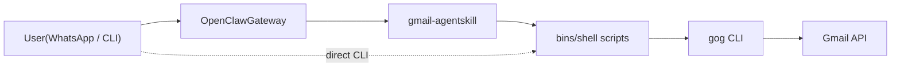

<!-------->
[](#)
[](https://github.com/nicholasgasior/gog)
[](https://openclaw.ai)
[](https://clawhub.ai/r39132/gmail-agent)
[](./LICENSE)


---

<p align="center">
  
</p>

# Gmail Agent

A CLI-driven Gmail agent that summarizes unread messages and purges spam/trash folders. Ships with an [OpenClaw](https://openclaw.ai) skill for chat-based and scheduled use, but the core scripts work standalone with **any agent framework** or directly from the command line.

---

## Quick Start

> Full GCP/OAuth setup instructions: **[Setup Guide](docs/SETUP.md)**

```bash
# 1. Install the CLI tools
brew install jq bash          # macOS — Linux: apt-get install jq
npm install -g gogcli

# 2. Authenticate with Google
gog auth login

# 3. Set your Gmail account
echo 'GMAIL_ACCOUNT="you@gmail.com"' > .env && source .env

# 4. Try it out
gog gmail messages search "is:unread in:inbox" --account "$GMAIL_ACCOUNT" --max 5 --plain
```

---

## Demo

<p align="center">
  
  <br />
  <em>Gmail Agent delivering an inbox summary via WhatsApp through OpenClaw</em>
</p>

The screenshot shows a WhatsApp conversation where I'm messaging myself. **Mr. Krabs**, my OpenClaw Superagent, listens to incoming messages and responds by executing the Gmail Agent skill. When I send "Summarize my inbox," Mr. Krabs triggers the skill, fetches my unread emails via the Gmail API, and replies with the summary—all within the same WhatsApp thread.

---

## Features

| Capability | Description |
|---|---|
| **Inbox summary** | Lists unread messages with sender, subject, and date. Groups by sender when count > 20. |
| **Folder structure** | Tree view of all Gmail labels with total and unread counts. |
| **Label audit & cleanup** | Inspects a label hierarchy; identifies single-label messages safe to remove. |
| **Spam & trash purge** | Batch-removes all messages from SPAM and TRASH folders. |
| **Daily digest** | Scheduled cron job: summarize + purge, delivered to WhatsApp (via OpenClaw). |

---

## How It Works



The agent is a set of **bash scripts** that wrap the [`gog` CLI](https://github.com/nicholasgasior/gog). OpenClaw provides chat routing and scheduling, but the scripts run independently — pipe them into any framework that can exec shell commands.

---

## Usage

### Standalone (CLI)

```bash
source .env

# Summarize unread inbox messages
gog gmail messages search "is:unread in:inbox" --account "$GMAIL_ACCOUNT" --max 50 --plain

# Summarize ALL unread messages (excludes spam/trash)
gog gmail messages search "is:unread -in:spam -in:trash" --account "$GMAIL_ACCOUNT" --max 50 --plain

# Show folder structure with message counts
bash skills/gmail-agent/bins/gmail-labels.sh

# Audit a label (report only)
bash skills/gmail-agent/bins/gmail-label-audit.sh "Professional/Companies"

# Audit + clean up single-label messages
bash skills/gmail-agent/bins/gmail-label-audit.sh "Professional/Companies" --cleanup

# Clean spam and trash
bash skills/gmail-agent/bins/gmail-cleanup.sh
```

### With OpenClaw

```bash
# Install the skill from ClawHub (recommended)
clawhub install gmail-agent

# Or install from source
bash setup/install-skill.sh

# Register the daily cron job
bash setup/register-cron-jobs.sh

# Verify
openclaw skills list | grep gmail
openclaw cron list
```

Then message OpenClaw through any connected channel:

- *"Summarize my unread emails"*
- *"Check my inbox"*
- *"Show my folder structure"*
- *"Audit my Professional/Companies label"*
- *"Clean up the Personal/Taxes/2020 label"*
- *"Clean my spam and trash"*

The cron job fires daily at noon Pacific (configurable in `.env`). It summarizes all unread emails, purges spam and trash, and delivers the report to WhatsApp.

<details>
<summary>With other agent frameworks</summary>

The core logic is plain shell commands using the `gog` CLI. You can integrate it with any framework that can execute shell commands.

**Claude Code / Claude Desktop (MCP)** — Use the `gog` commands from `SKILL.md` as tool calls. The SKILL.md file itself serves as a prompt/instruction document that any LLM agent can follow.

**LangChain / LangGraph** — Wrap the shell commands as tools:

```python
from langchain_core.tools import tool
import subprocess, os

@tool
def summarize_inbox() -> str:
    """List unread Gmail messages."""
    result = subprocess.run(
        ["gog", "gmail", "messages", "list",
         "is:unread",
         "--account", os.environ["GMAIL_ACCOUNT"],
         "--max", "50", "--json"],
        capture_output=True, text=True
    )
    return result.stdout

@tool
def clean_spam_trash() -> str:
    """Purge spam and trash folders."""
    result = subprocess.run(
        ["bash", "skills/gmail-agent/bins/gmail-cleanup.sh"],
        capture_output=True, text=True
    )
    return result.stdout
```

**CrewAI** — Use CrewAI's shell tool or a custom tool that calls `gmail-cleanup.sh` and the `gog` CLI commands listed in SKILL.md.

**Plain cron (no agent framework)** — Schedule via system cron:

```bash
# crontab -e
0 12 * * * source ~/.env && bash ~/Projects/gmail-agent/skills/gmail-agent/bins/gmail-cleanup.sh >> ~/gmail-agent.log 2>&1
```

</details>

---

## Project Structure

```
gmail-agent/
├── .env.example                       # Template for environment variables
├── .gitignore                         # Excludes .env, credentials, OS artifacts
├── README.md                          # This file
├── docs/
│   ├── SETUP.md                       # Full GCP/OAuth setup guide
│   └── images/
├── skills/
│   └── gmail-agent/
│       ├── SKILL.md                   # Agent skill definition (OpenClaw + general)
│       └── bins/
│           ├── gmail-cleanup.sh       # Spam & trash purge script
│           ├── gmail-label-audit.sh   # Label audit & selective cleanup
│           └── gmail-labels.sh        # Label tree with message counts
└── setup/
    ├── install-skill.sh               # Symlink skill into OpenClaw workspace
    └── register-cron-jobs.sh          # Register cron jobs via OpenClaw CLI
```

| Layer | Files | Framework dependency |
|---|---|---|
| **Core logic** | `gmail-cleanup.sh`, `gmail-label-audit.sh`, `gmail-labels.sh`, `gog` CLI commands in SKILL.md | None — just bash + gog + jq |
| **Agent instructions** | `SKILL.md` | OpenClaw format, but readable by any LLM |
| **OpenClaw integration** | `setup/*.sh` | OpenClaw CLI |

## Configuration

| Variable | Required | Description |
|---|---|---|
| `GMAIL_ACCOUNT` | Yes | Gmail address to manage |
| `CRON_TIMEZONE` | No | Timezone for scheduled runs (default: `America/Los_Angeles`) |
| `CRON_SCHEDULE` | No | Cron expression (default: `0 12 * * *` = noon daily) |

## Troubleshooting

<details>
<summary><code>gog: command not found</code></summary>

Install it: `npm install -g gogcli`. Ensure your npm global bin directory is in `$PATH`.
</details>

<details>
<summary><code>jq: command not found</code></summary>

Install via your package manager — see [Setup Guide](docs/SETUP.md#1-install-prerequisites).
</details>

<details>
<summary><code>Error: No Gmail account specified</code></summary>

Set `GMAIL_ACCOUNT` in your `.env` file and run `source .env`, or pass it as an argument:
```bash
bash skills/gmail-agent/bins/gmail-cleanup.sh your-email@gmail.com
```
</details>

<details>
<summary>Gmail API returns 403 Forbidden</summary>

1. Confirm the Gmail API is enabled in your GCP project
2. Verify your OAuth consent screen includes the `gmail.readonly` and `gmail.modify` scopes
3. Re-authenticate: `gog auth login`
</details>

<details>
<summary>Cron job not firing (OpenClaw)</summary>

```bash
openclaw cron list                       # Is the job registered?
openclaw cron run gmail-daily-noon       # Does manual trigger work?
openclaw gateway status                  # Is the gateway running?
```
</details>

## License

MIT
