<!-------->
[](#)
[](https://github.com/nicholasgasior/gog)
[](https://openclaw.ai)
[](https://clawhub.ai/r39132/gmail-skill)
[](./LICENSE)


[](https://docs.anthropic.com/en/docs/claude-code)
[](https://anthropic.com)
[](https://anthropic.com)

<p align="center">
  
</p>

# Gmail Skill

CLI-powered Gmail automation • Inbox summaries • Spam cleanup • Label management • Background execution with WhatsApp notifications

**[Install →](#install) • [Commands →](#commands) • [Setup Guide →](docs/SETUP.md)**

## Install

```bash
brew install jq bash && npm install -g gogcli
gog auth login
echo 'GMAIL_ACCOUNT="you@gmail.com"' > .env && source .env
```

**[Full setup guide →](docs/SETUP.md)**

## Commands

```bash
source .env  # Load config

# Inbox summary (all messages, marks unread with **)
gog gmail messages search "in:inbox" --account "$GMAIL_ACCOUNT" --max 50 --plain

# All unread (across all folders)
gog gmail messages search "is:unread -in:spam -in:trash" --account "$GMAIL_ACCOUNT" --max 50 --plain

# Folder structure
bash skills/gmail-skill/bins/gmail-labels.sh "$GMAIL_ACCOUNT"

# Clean spam & trash
bash skills/gmail-skill/bins/gmail-cleanup.sh "$GMAIL_ACCOUNT"

# Move messages to label (interactive)
bash skills/gmail-skill/bins/gmail-move-to-label.sh "$GMAIL_ACCOUNT" --search-labels "receipts"
bash skills/gmail-skill/bins/gmail-move-to-label.sh "$GMAIL_ACCOUNT" --list-inbox
bash skills/gmail-skill/bins/gmail-move-to-label.sh "$GMAIL_ACCOUNT" --move "Personal/Receipts" msg-1 msg-2
bash skills/gmail-skill/bins/gmail-move-to-label.sh "$GMAIL_ACCOUNT" --undo "Personal/Receipts" msg-1 msg-2

# Delete label + messages (destructive)
bash skills/gmail-skill/bins/gmail-delete-labels.sh "Professional/OldCompany" "$GMAIL_ACCOUNT"
bash skills/gmail-skill/bins/gmail-delete-labels.sh "Professional/OldCompany" --delete-messages "$GMAIL_ACCOUNT"

# Delete old messages by date
bash skills/gmail-skill/bins/gmail-delete-old-messages.sh "Personal/Archive" "01/01/2020" "$GMAIL_ACCOUNT"

# Enable permanent delete (one-time OAuth)
bash skills/gmail-skill/bins/gmail-auth-full-scope.sh "$GMAIL_ACCOUNT"

# Background execution
export WHATSAPP_NOTIFY_TARGET="+15555550123"
bash skills/gmail-skill/bins/gmail-bg "Task Name" "bash skills/gmail-skill/bins/gmail-cleanup.sh '$GMAIL_ACCOUNT'"
bash skills/gmail-skill/bins/gmail-jobs              # Status
bash skills/gmail-skill/bins/gmail-jobs --running    # Running only
bash skills/gmail-skill/bins/gmail-jobs --clean      # Remove old
```

---

## Demo

<p align="center">
  
</p>

---

## Features

| Feature | Command |
|---------|--------|
| **Inbox summary** | Lists all inbox messages, marks unread with ** |
| **All unread** | Search all unread across folders (excluding spam/trash) |
| **Folder tree** | Visual tree of labels with message counts (1-2min) |
| **Spam cleanup** | Batch delete spam and trash |
| **Move messages** | Interactive label search and message mover |
| **Delete labels** | Remove label + sublabels, optionally trash all messages |
| **Delete by date** | Remove messages older than date from label |
| **Permanent delete** | OAuth for `https://mail.google.com/` scope |
| **Background tasks** | Run with WhatsApp progress notifications |
| **Job tracking** | Monitor running/completed jobs with logs |
| **Daily digest** | Scheduled summary + cleanup via cron |

<details>
<summary><b>WhatsApp Notifications Example</b></summary>

```
📧 Gmail Skill: Starting task 'Spam & Trash Cleanup'
Account: you@gmail.com • Started: 2026-02-11 14:30:00
Running in background... Updates every 30s

⏳ Task still running... Duration: 1m 30s

✅ Task completed successfully • Duration: 2m 45s
━━━━━━━━━━━━━━━━━━━━━━━━━━
Output:
Spam: 124 messages cleaned
Trash: 89 messages cleaned
Log: /tmp/gmail-bg-20260211-143000.log
```

</details>

---

## OpenClaw Integration

```bash
# Install from ClawHub
clawhub install gmail-skill

# Or from source
bash setup/install-skill.sh
bash setup/register-cron-jobs.sh

# Verify
openclaw skills list | grep gmail
openclaw cron list
```

**Example triggers** (semantic, not exact):
- "Summarize my inbox" / "Check my email" / "What's new?"
- "Show folder structure" / "List my labels"
- "Clean spam and trash" / "Empty junk"
- "Move messages to Receipts" / "File in Travel folder"
- "Delete Professional/OldCompany label"
- "Delete messages before 01/01/2020 from Archive"

**Daily digest cron:**
```bash
openclaw cron run gmail-daily-noon  # Manual trigger
```

<details>
<summary><b>All Skill Capabilities</b></summary>

| Skill | Triggers | Notes |
|-------|----------|-------|
| **Inbox Summary** | "Check email", "Show inbox" | Lists all (marks unread **), groups by sender >20 |
| **Folder Structure** | "Show labels", "Folder tree" | 1-2min runtime |
| **Spam Cleanup** | "Clean spam", "Purge trash" | Batch delete |
| **Move to Label** | "Move to Receipts", "File in Travel" | Interactive workflow |
| **Delete Label** | "Delete Professional/OldCompany" | + sublabels, optional message delete |
| **Delete by Date** | "Delete before 01/01/2020 from Archive" | Permanent if full-scope token exists |
| **Daily Digest** | Auto: noon Pacific (cron) | Summary + cleanup → WhatsApp |

</details>

---

## Architecture

Two paths to the Gmail API — through an agent framework, or directly from the CLI:

```mermaid
%%{init: {'theme':'default', 'themeVariables': {'fontSize':'16px'}}}%%
flowchart TD
    subgraph entry ["Entry Points"]
        WA["📱 WhatsApp"]
        CLI["💻 Terminal"]
        Cron["⏰ Cron"]
    end

    subgraph agent ["Agent Layer (optional)"]
        OC["OpenClaw Gateway"]
        Skill["gmail-skill\n(SKILL.md)"]
    end

    subgraph core ["Core (bash + gog + jq)"]
        Scripts["Shell Scripts\n(skills/gmail-skill/bins/)"]
        GOG["gog CLI"]
    end

    subgraph google ["Google"]
        API["Gmail API"]
    end

    WA --> OC --> Skill --> Scripts
    Cron --> OC
    CLI --> Scripts
    Scripts --> GOG --> API
    Scripts -.->|"label delete,\npermanent delete"| API

    style entry fill:#f0f4ff,stroke:#94a3b8
    style agent fill:#fefce8,stroke:#ca8a04
    style core fill:#f0fdf4,stroke:#22c55e
    style google fill:#fef2f2,stroke:#ef4444
```



**Key design decision:** every layer is optional except `core`. Strip away OpenClaw and you still have CLI tools. The agent layer adds chat routing (WhatsApp) and scheduling (cron) — but the scripts run independently with any framework that can exec shell commands.

The dashed line shows where scripts call the Gmail API directly via Python (for label deletion and permanent message deletion) instead of going through `gog`, since `gog` doesn't expose those endpoints.

---

## Integration Examples

<details>
<summary><b>LangChain / LangGraph</b></summary>

```python
from langchain_core.tools import tool
import subprocess, os

@tool
def summarize_inbox() -> str:
    """List unread Gmail messages."""
    result = subprocess.run(
        ["gog", "gmail", "messages", "list", "is:unread",
         "--account", os.environ["GMAIL_ACCOUNT"], "--max", "50", "--json"],
        capture_output=True, text=True
    )
    return result.stdout

@tool
def clean_spam_trash() -> str:
    """Purge spam and trash folders."""
    result = subprocess.run(
        ["bash", "skills/gmail-skill/bins/gmail-cleanup.sh"],
        capture_output=True, text=True
    )
    return result.stdout
```

</details>

<details>
<summary><b>Claude Desktop / MCP</b></summary>

Use `gog` commands from `SKILL.md` as tool calls. The SKILL.md file serves as instruction document for LLM agents.

</details>

<details>
<summary><b>System Cron (no agent)</b></summary>

```bash
# crontab -e
0 12 * * * source ~/.env && bash ~/Projects/gmail-skill/skills/gmail-skill/bins/gmail-cleanup.sh >> ~/gmail-skill.log 2>&1
```

</details>

---

## Project Structure

```
gmail-skill/
├── skills/gmail-skill/bins/
│   ├── gmail-cleanup.sh              # Spam & trash purge
│   ├── gmail-labels.sh               # Folder tree view
│   ├── gmail-move-to-label.sh        # Interactive label mover
│   ├── gmail-delete-labels.sh        # Delete labels + messages
│   ├── gmail-delete-old-messages.sh  # Delete by date
│   ├── gmail-auth-full-scope.sh      # OAuth for permanent delete
│   ├── gmail-background-task.sh      # Background runner
│   ├── gmail-bg-status.sh            # Job status viewer
│   ├── gmail-daily-digest.sh         # Summary + cleanup for cron
│   ├── gmail-bg                      # Convenience: auto-sources .env
│   └── gmail-jobs                    # Convenience: job status
├── setup/
│   ├── install-skill.sh              # OpenClaw skill installer
│   └── register-cron-jobs.sh         # Cron registration
├── docs/SETUP.md                     # Full GCP/OAuth setup
├── docs/openclaw-config-guide.md     # OpenClaw safe config checklist
├── blogs/                            # Blog posts
└── skills/gmail-skill/SKILL.md       # Skill definition
```

**Dependencies by layer:**
- **Core:** bash + `gog` + jq + python3 (google-auth, google-api-python-client)
- **Full-scope:** +google-auth-oauthlib  
- **Background:** +OpenClaw (WhatsApp notifications)
- **Agent:** OpenClaw format, works with any LLM framework

---

## Configuration

```bash
# .env
GMAIL_ACCOUNT="you@gmail.com"                    # Required
WHATSAPP_NOTIFY_TARGET="+15555550123"            # Optional: E.164 format
WHATSAPP_UPDATE_INTERVAL=30                      # Optional: seconds between updates
CRON_TIMEZONE="America/Los_Angeles"              # Optional: cron timezone
CRON_SCHEDULE="0 12 * * *"                       # Optional: noon daily
```

**Files:**
- `~/.gmail-skill/full-scope-token.json` — Full-scope OAuth for permanent delete
- `~/.gmail-skill/jobs/` — Background job registry

---

## Troubleshooting

<details>
<summary><code>gog: command not found</code></summary>

Install it: `npm install -g gogcli`. Ensure your npm global bin directory is in `$PATH`.
</details>

<details>
<summary><code>jq: command not found</code></summary>

Install via your package manager — see [Setup Guide](docs/SETUP.md#1-install-prerequisites).
</details>

<details>
<summary><code>Error: No Gmail account specified</code></summary>

Set `GMAIL_ACCOUNT` in your `.env` file and run `source .env`, or pass it as an argument:
```bash
bash skills/gmail-skill/bins/gmail-cleanup.sh your-email@gmail.com
```
</details>

<details>
<summary>Gmail API returns 403 Forbidden</summary>

1. Confirm the Gmail API is enabled in your GCP project
2. Verify your OAuth consent screen includes the `gmail.readonly` and `gmail.modify` scopes
3. Re-authenticate: `gog auth login`
</details>

<details>
<summary>Cron job not firing (OpenClaw)</summary>

```bash
openclaw cron list                       # Is the job registered?
openclaw cron run gmail-daily-noon       # Does manual trigger work?
openclaw gateway status                  # Is the gateway running?
```
</details>

<details>
<summary>Label deletion fails with missing Python packages</summary>

Label deletion requires Python packages for direct Gmail API access. Install them:

```bash
pip install google-auth google-api-python-client
```

The script also needs `gog` OAuth credentials (created during `gog auth login`).
</details>

<details>
<summary>Messages are trashed instead of permanently deleted</summary>

By default, delete operations trash messages (auto-deleted by Gmail after 30 days). To enable permanent deletion:

```bash
bash skills/gmail-skill/bins/gmail-auth-full-scope.sh "$GMAIL_ACCOUNT"
```

This performs a one-time OAuth flow for the `https://mail.google.com/` scope and stores the token at `~/.gmail-skill/full-scope-token.json`. Requires `pip install google-auth-oauthlib`.
</details>

<details>
<summary>Full-scope auth fails with missing google-auth-oauthlib</summary>

The full-scope authorization script requires an additional Python package:

```bash
pip install google-auth-oauthlib
```
</details>

## Blog

- [Managing Gmail from WhatsApp: An Agent-Driven Approach](blogs/blog_1.md) — Introduction and motivation
- [From Cleanup to Full Inbox Control](blogs/blog_2.md) — New capabilities: move, delete, permanent delete, background tasks
- [OpenClaw Has Rough Edges — Here's How to Avoid Them](blogs/blog_3.md) — Pitfalls, safe defaults, and a [configuration guide](docs/openclaw-config-guide.md)

## License

MIT
